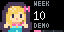
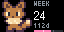

# Baby Size

By **[cptntrps](https://github.com/cptntrps)**.

Follow pregnancy progress with 95 rotating pixel-art comparisons: fruit, everyday
objects, familiar characters, and 25 Gen 1 Pokemon. The first page shows a large
sprite, pregnancy week and days remaining. The second shows the comparison's name,
estimated length and weight. The third shows a playful development fact for that
week, followed by a practical pregnancy tip. A progress bar marks the trimesters.





## Settings

- **Due date:** select the expected date. The time portion is ignored. With no
  date set, the app shows a week-10 example marked `DEMO`.
- **Language:** English or Portuguese.

The app uses the device timezone, falling back to UTC. It works offline, makes no
network requests, and needs no API key. Designed for classic **64x32** displays.
The full animation lasts 15 seconds: 3 seconds for the week, 3 for the size,
4 for development, and 5 for a tip. A one-minute refresh changes the comparison.

Weekly development cards cover weeks 4–40 in both languages. They describe typical
development around that week; timing varies for each baby. Before week 4 and from
week 41 onward, a general timing message replaces the weekly fact.
[Every development fact has an NHS source](DEVELOPMENT.md).

The **TRY THIS** card draws from nine suggestions grounded in NHS, NIH, and CDC
guidance, with its main source credited on the panel. [Tip sources and explanations](TIPS.md)
describe the evidence and limitations. Nutrition tips apply throughout pregnancy;
their placement beside a milestone does not mean a food causes that milestone.
Food suggestions are for the pregnant parent and should fit their allergies and
prenatal care. Voice activities carry no claim of improved intelligence.

Length and weight are illustrative weekly estimates, not individual measurements.
Length switches from crown-rump through week 19 to crown-heel at week 20, so the
app does not interpolate across that change. Before week 4 it uses the earliest
comparison; on or after the due date it shows week 40 and a greeting.

Pokemon compare **height only**. They appear after week 20, and only when the
estimated length is within 10% of the character's official height. The weight
shown is always the baby's estimate. Heights are documented by national Pokedex
number in `pokemon.py`, with sources at the [official Pokedex](https://sg.portal-pokemon.com/pokedex/).

## Development

The app is self-contained in `baby_size.star`. Its editable sources are:

- `build.py`: weekly data, selections, settings, and Starlark layout template.
- `sprites.py`: original 16x16 text sprites and palettes, plus the Kenney adaptation.
- `pokemon.py`: the Pokemon selection, official heights, and original text sprites.
- `development.py`: 37 bilingual development facts with per-week NHS sources.
- `tips.py`: practical tips, factual explanations, source URLs, and week pairings.

Install Pillow for rebuilding, and use the repository's pinned Pixlet version:

```sh
python3 -m pip install Pillow
python3 build.py
python3 test_baby_size.py
pixlet lint baby_size.star
pixlet check .
pixlet render -z 9 baby_size.star
```

`build.py` runs `pixlet format` after generation. Set `PIXLET=/path/to/pixlet` if
the binary is not on `PATH`. Tests cover date validation, daylight-saving date
boundaries, daily comparison eligibility, sprite completeness, weekly development
selection and rendering in both languages, and reproducibility.

## Attribution

Copyright 2026 **cptntrps**. Code and original sprite drawings were developed with
OpenAI Codex and are contributed under this repository's Apache-2.0 license.

Development facts are original short summaries based on **NHS Best Start in Life**,
checked on 2026-10-10. [Per-week sources and context](DEVELOPMENT.md). The NHS has
not reviewed or endorsed this app.

Practical tips use public guidance from **NHS, NIH, and CDC**, with individual
citations in [TIPS.md](TIPS.md). Those organizations have not endorsed this app.

The Polly Pocket sprite adapts **Kenney's Tiny Dungeon**, `Tiles/tile_0099.png`,
licensed **CC0**. The adaptation changes the hair, clothing, and bow colors.
[Kenney asset page](https://kenney.nl/assets/tiny-dungeon). See `NOTICE` for the
third-party credit. Character and product names refer to their respective owners;
this community app is not an official branded product.
