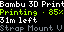

# Bambu Printer Status for Tidbyt

Bambu Printer Status shows live information from your Bambu printer’s status.json endpoint on your Tidbyt. It displays the printer name, current state, and a combined job line including job name, plate name, and job objects, plus a small timestamp or job footer. If you have not configured a status URL yet, the app shows simple on-device setup instructions instead of failing. Setup details for creating and hosting the JSON status URL are available in bambu_printer_status_json_setup_instructions.pdf.

