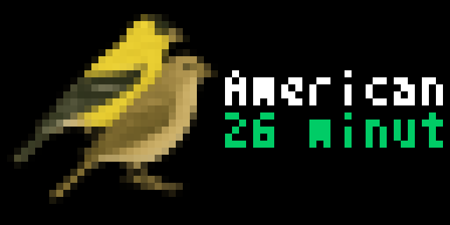

# Bird Buddy for Tidbyt

Display your latest Bird Buddy feeder visitors on your Tidbyt display!

🐦 **Real Bird Species Icons** - Shows actual bird illustrations from Bird Buddy's API

## Setup

### Prerequisites

- A [Bird Buddy](https://mybirdbuddy.com/) smart bird feeder and account
- Your Bird Buddy login credentials (email and password) Sorry no Oauth Support, only Email/password account work

### Installation

1. Install the Bird Buddy app on your Tidbyt device
2. Configure the app with your Bird Buddy credentials:
   - **Bird Buddy Email**: Your Bird Buddy account email
   - **Bird Buddy Password**: Your Bird Buddy account password

## How It Works

The app connects to Bird Buddy's GraphQL API to:

1. **Authenticate** with your Bird Buddy account
2. **Fetch your feeders** and recent activity
3. **Display the latest visitor** with species name and timestamp
5. **Cache data** to reduce API calls and improve performance

## Troubleshooting

### "Configure Bird Buddy credentials"
- Ensure you've entered your Bird Buddy email and password correctly
- Verify your Bird Buddy account is active and accessible
- Not using OAuth credentials

### "Authentication failed"
- Double-check your email and password
- Try logging into Bird Buddy's website to verify credentials

### "No feeders found"
- Ensure your Bird Buddy feeder is set up and connected
- Check that your feeder appears in the Bird Buddy mobile app

### API Errors
- Bird Buddy API may be temporarily unavailable
- App will show fallback content (House Finch) during outages
- Data will refresh automatically when service resumes

## Credits

- **Bird Species Icons**: Provided by Bird Buddy's API
- **API Integration**: Based on [PyBirdBuddy](https://github.com/jhansche/pybirdbuddy) reference implementation
- **Developer**: Brombomb

## License

This app is designed for use with the Tidbyt display and Bird Buddy smart feeder. Bird Buddy trademarks and bird illustrations are property of Bird Buddy Inc.

---

*Bring your backyard birds to your Tidbyt! 🐦*
