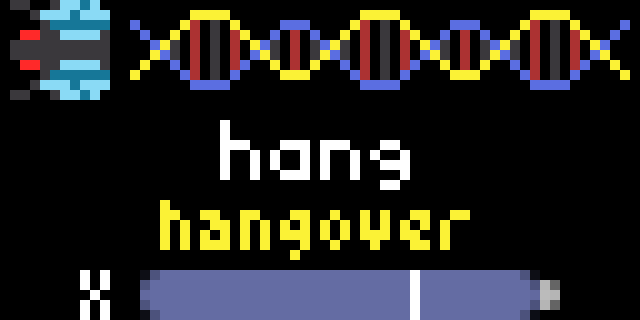

# Fly Gene for Tronbyt
Displays a random gene from the fruit fly *Drosophila melanogaster*. Each gene shows its short name, full name, chromosome location, and top gene ontology (GO) term. Genes are pulled from a curated library (described below).

## About *Drosophila* genes
In *Drosophila*, some [13,900 genes](https://doi.org/10.1093/genetics/iyad187) that encode proteins reside on just four pairs of chromosomes. For comparison, humans have just under [20,000 genes](https://doi.org/10.1126/science.abj6987) across 23 pairs of chromosomes. Many genes share similar functions between the two.

Scientists who discover *Drosophila* genes often come up with clever names for them depending on what that gene does when it's mutated.

For example, one mutated *Drosophila* gene prevents the heart from forming during development. The researcher who [found this gene](https://doi.org/10.1242/dev.118.3.719) named it *tinman* (or *tin*, for short), because the Tin Man in *The Wizard of Oz* also lacks a heart!

Another mutated gene causes flies to live twice as long as normal flies. The researchers [named the gene](https://doi.org/10.1126/science.290.5499.2137) *Indy*, short for *I'm not dead yet*.

Not every gene name is clever. Some can be boring or straightforward...but there are many funny, witty gems that exist throughout the fruit fly genome.

## Gene curation method
In this app, only 7,702 genes have been included for display. To be included, each gene had to satisfy all of the following:

- be from the annotated *Drosophila melanogaster* genome;
- be protein coding;
- have a defined genomic sequence location;
- have a name (i.e., not start with the CG prefix);
- have a UniProt accession; and
- have a defined GO term.

Curation of the library occurred as follows (all [downloads](https://wiki.flybase.org/wiki/FlyBase:Downloads_Overview) are from FlyBase release FB2025_05):

1. `gene_map_table_*.tsv` was used as a starting point, because it includes all genes on FlyBase that have at least one type of known genomic location. This database was filtered by considering only genes where all of the following were true:
    - `organism_abbreviation` was `Dmel`;
    - `current_symbol` did not match the following regex patterns:
        - `.*CG\d{2,}.*`
        - `.*CR\d{2,}.*`
        - `.*RNA:.*`
        - `.*:RNA.*`
        - `.*mt:.*`;
    - `current_symbol` did not match to RNA coding genes; and
    - `sequence_loc` was not empty.
2. To obtain UniProt accessions, `fbgn_NAseq_Uniprot_*.tsv` was used to select for genes from step 1 where `UniprotKB/Swiss-Prot/TrEMBL_accession` was not empty.
3. Some genes (3,675) from step 2 had more than one UniProt accession. To find the most annotated one, the UniProt accession associated with an AlphaFold DB entry on FlyBase was used. To accomplish this, `chado_FBgn_xml.zip` was searched for these multi-UniProt genes, and the UniProt accession listed under the AlphaFold DB reference for each gene was extracted. This allowed for one UniProt accession to be assigned to each gene from step 2.
4. Next, the top GO term for each UniProt accession from step 3 was determined. The following additional files were used: `goa_uniprot_all.gaf.gz` (release 229; [from EMBL-EBI](https://www.ebi.ac.uk/GOA/downloads)); and `go-basic.obo` (release 2025-10-10; [from GOC](https://zenodo.org/records/17382285)). `goa_uniprot_all.gaf` was searched for each UniProt accession found in step 3. The most frequent GO term where `Aspect` = `P` (i.e., the GO was a biological process) was preferred. If there was a tie, the "narrowest" GO term (i.e., the term with the fewest children as defined in `go-basic.obo`) was used. If no `P` GO terms were found, this process was repeated for `Aspect` = `F` (molecular function). Lastly, the name of the GO term was extracted from `go-basic.obo`. Genes where the GO was `GO:0008150` ("biological process") or `GO:0003674` ("molecular function") were excluded (180 genes in total), as these were deemed overly broad GO terms.
5. To obtain the full name of the gene, `fb_synonym_*.tsv` was used to match each FBgn ID derived from step 3 to its short and full name.
6. The final gene library was assembled by compiling each selected gene's short name, full name, sequence location, FBgn ID, UniProt ID, GO ID, and GO name. 

## References
Aleksander, S.A., Balhoff, J., Carbon, S., Cherry, J.M., Drabkin, H.J., Ebert, D., Feuermann, M., Gaudet, P., Harris, N.L., et al. (2023). The Gene Ontology knowledgebase in 2023. GENETICS *224*. [https://doi.org/10.1093/genetics/iyad031](https://doi.org/10.1093/genetics/iyad031).

Ashburner, M., Ball, C.A., Blake, J.A., Botstein, D., Butler, H., Cherry, J.M., Davis, A.P., Dolinski, K., Dwight, S.S., Eppig, J.T., et al. (2000). Gene Ontology: tool for the unification of biology. Nat Genet *25*, 25–29. [https://doi.org/10.1038/75556](https://doi.org/10.1038/75556).

Bateman, A., Martin, M.-J., Orchard, S., Magrane, M., Adesina, A., Ahmad, S., Bowler-Barnett, E.H., Bye-A-Jee, H., Carpentier, D., et al. (2024). UniProt: the Universal Protein Knowledgebase in 2025. Nucleic Acids Research *53*, D609–D617. [https://doi.org/10.1093/nar/gkae1010](https://doi.org/10.1093/nar/gkae1010).

Bodmer, R. (1993). The gene *tinman* is required for specification of the heart and visceral muscles in *Drosophila*. Development 118, 719–729. [https://doi.org/10.1242/dev.118.3.719](https://doi.org/10.1242/dev.118.3.719).

Carbon, S., and Mungall, C. (2025). Gene Ontology Data Archive. Version 2025-10-10 (Zenodo). [https://doi.org/10.5281/zenodo.17382285](https://doi.org/10.5281/zenodo.17382285).

Mohr, S.E., Kim, A.-R., Hu, Y., and Perrimon, N. (2023). Finding information about uncharacterized *Drosophila melanogaster* genes. GENETICS *225*. [https://doi.org/10.1093/genetics/iyad187](https://doi.org/10.1093/genetics/iyad187).

Nurk, S., Koren, S., Rhie, A., Rautiainen, M., Bzikadze, A.V., Mikheenko, A., Vollger, M.R., Altemose, N., Uralsky, L., Gershman, A., et al. (2022). The complete sequence of a human genome. Science *376*, 44–53. [https://doi.org/10.1126/science.abj6987](https://doi.org/10.1126/science.abj6987).

Öztürk-Çolak, A., Marygold, S.J., Antonazzo, G., Attrill, H., Goutte-Gattat, D., Jenkins, V.K., Matthews, B.B., Millburn, G., dos Santos, G., Tabone, C.J., et al. (2024). FlyBase: updates to the *Drosophila* genes and genomes database. GENETICS *227*. [https://doi.org/10.1093/genetics/iyad211](https://doi.org/10.1093/genetics/iyad211).

Rogina, B., Reenan, R.A., Nilsen, S.P., and Helfand, S.L. (2000). Extended Life-Span Conferred by Cotransporter Gene Mutations in *Drosophila*. Science *290*, 2137–2140. [https://doi.org/10.1126/science.290.5499.2137](https://doi.org/10.1126/science.290.5499.2137).

## Attributions
[FlyBase](https://flybase.org) data from the FB2025_05 release is made available under the terms of the [CC BY 4.0 license](https://creativecommons.org/licenses/by/4.0/).

[Gene Ontology](https://geneontology.org/) data from the 2025-10-10 release ([DOI:10.5281/zenodo.10536401](https://doi.org/10.5281/zenodo.17382285)) is made available under the terms of the [CC BY 4.0 license](https://creativecommons.org/licenses/by/4.0/).

[UniProt](https://www.uniprot.org) data from the 2025_03 release is made available under the terms of the [CC BY 4.0 license](https://creativecommons.org/licenses/by/4.0/).

[UniProt GOA](https://www.ebi.ac.uk/GOA/) data from the 229 release is made available under the terms of the [CC BY 4.0 license](https://creativecommons.org/licenses/by/4.0/).

The `header.png` image was created using [emojis](https://emoji.serenityos.org/) by [Gegga Thor](https://github.com/Xexxa/) for [SerenityOS](https://serenityos.org/) and is made available under the terms of the [BSD 2-Clause License](https://opensource.org/license/bsd-2-clause).

## License 
The curated gene library in this repository is licensed under [CC BY 4.0](https://creativecommons.org/licenses/by/4.0/); if you reuse or redistribute it (including modified versions), you must attribute it to frame-shift and clearly indicate any changes.