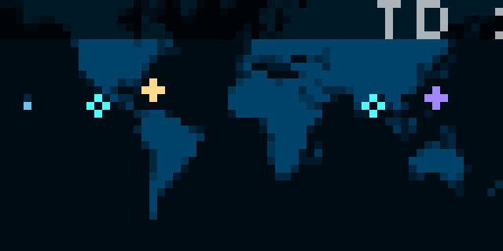
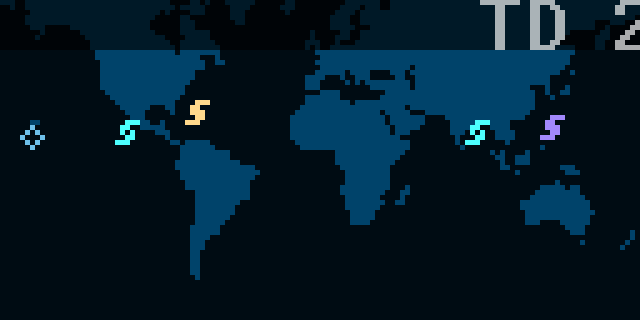
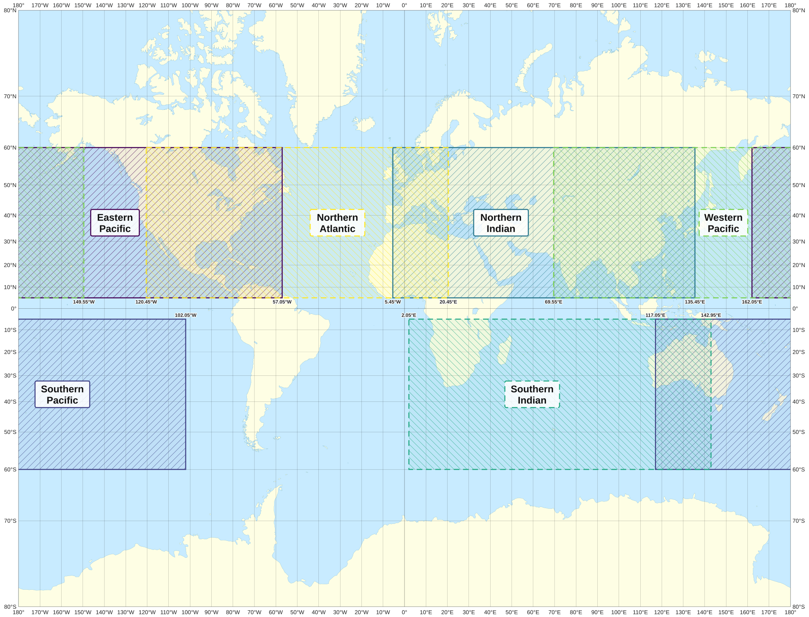

# Hurricane Map for Tronbyt
Displays current global tropical depressions, storms, hurricanes, cyclones, and typhoons.

Users can customize their preferred basin (see below), colors, and symbols. They can also hide the app if no storms are present in the selected basin.

This app supports 2x display: 

## Basins
In addition to global maps, users can choose specific basins to display.

Selection of the bounds for the basins was adapted from [Bloemendaal et al., 2020](https://doi.org/10.1038/s41597-020-0381-2) (Figure 1). The lateral bounds of the boxes were expanded to fit a 2:1 aspect ratio.

## Symbols
For this app, the [Saffir-Simpson scale](https://en.wikipedia.org/wiki/Saffir%E2%80%93Simpson_scale) is used to classify storm intensity.

A storm's intensity dictates which shapes and colors to use, depending on the selected symbol size. Below is a table of how the symbols will appear using their default colors. The center of a storm is always anchored to the center of its symbol.

|                     | Large | Medium | Small |
|---------------------|-------|--------|-------|
| Tropical Depression |  |  |  |
| Tropical Storm      |  |  |  |
| Category 1          |  |  |  |
| Category 2          |  |  |  |
| Category 3          |  |  |  |
| Category 4          |  |  |  |
| Category 5          |  |  |  |

## Data sources
Storm data is combined from two sources:
- The [National Hurricane Center](http://www.nhc.noaa.gov/), which covers the Northern Atlantic and Eastern Pacific basins.
- The [Joint Typhoon Warning Center](https://www.metoc.navy.mil/jtwc/jtwc.html), which covers all other basins.

## Attributions
Basin map adapted from "[Tissot indicatrix world map Mercator proj.svg](https://commons.wikimedia.org/wiki/File:Tissot_indicatrix_world_map_Mercator_proj.svg)" by [Eric Gaba](https://commons.wikimedia.org/wiki/User:Sting), licensed under [CC BY-SA 4.0](https://creativecommons.org/licenses/by-sa/4.0/). Changes: Tissot indicatrix circles removed, cropped to 80°N - 80°S, degree labels and ocean basin boxes added. This adapted map is licensed under [CC BY-SA 4.0](https://creativecommons.org/licenses/by-sa/4.0/).

Coastline data © [OpenStreetMap contributors](https://www.openstreetmap.org/copyright), available under the [Open Database License (ODbL) 1.0](https://opendatacommons.org/licenses/odbl/1.0/).

The data was obtained via the `earth-coastlines` map (10 km resolution) from [geo-maps](https://github.com/simonepri/geo-maps) by Simone Primarosa (code licensed under the MIT License).

The map pattern arrays in `helper.star` is a derived rasterization of this data (128x64) and is made available under ODbL 1.0. The dynamically generated SVGs are Produced Works based on OpenStreetMap data.