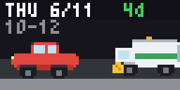

# LA Street Sweep

Counts down to your next Los Angeles street sweeping day. A side-view car sits at
the curb while the street-sweeper truck creeps closer each day (the countdown chip
goes green → amber → red); on sweep day the car is gone and the sweeper passes the
freshly-cleaned spot.

## Configuration

Set, per side of the street:

- **Day** of the week the side is swept
- **Weeks** — `1st & 3rd`, `2nd & 4th`, `Every week`, or `Non-posted`
- **Time** window (start / end)

Optionally enable **Track the other side too** for the opposite curb.

Find your days at **streets.lacity.gov/services/street-sweeping**.

## How it works

Sweep dates come straight from the City of LA's public street-sweeping Google
Calendar feeds. Those feeds are already holiday-adjusted and contain no phantom
5th-week dates, so the next sweep is just the earliest feed date on your weekday
that isn't in the past — no address lookup, geocoding, or date math.

Author: Ryan Taylor (@ryantaylor16)
