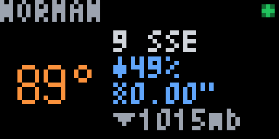

# OK Mesonet

A [Pixlet](https://github.com/tronbyt/pixlet) app for a 64×32 Tronbyt/Tidbyt display showing
**current conditions from one Oklahoma Mesonet station** — live 5-minute observations from the
[Oklahoma Mesonet](https://www.mesonet.org), the statewide environmental monitoring network
jointly operated by Oklahoma State University and the University of Oklahoma.



The frame:

- **Temperature** hero on the left, color-ramped: deep blue (≤32°F) → cyan → green → yellow →
  orange → red (≥100°F).
- **Station name** across the top (dim, scrolls if long) with a **freshness dot**: green
  (<15 min), amber (15–40 min), red (>40 min or offline). The feed itself publishes
  observations 5–13 minutes behind wall clock, so green covers normal operation.
- **Wind** — sustained + direction, with gusts (`11 SE G17`) shown when they exceed sustained
  by 5+ mph. `CALM` when still.
- **Humidity or dewpoint** (configurable), **rainfall today** (`0.00"` shown explicitly, the
  Oklahoma way), and **barometric pressure** (`1015mb`).

Two Oklahoma-specific accents, active even with temperature coloring off:

- **Heat accent** — heat index ≥ 105°F forces the temperature red.
- **Red-flag accent** — humidity ≤ 25% with sustained wind ≥ 20 mph turns the wind line red
  (fire weather).

## Configuration

| Field | Default | Notes |
|-------|---------|-------|
| **Station** | Norman (NRMN) | Any of the ~120 reporting Mesonet stations. |
| **Secondary metric** | Humidity (RH) | Or dewpoint. |
| **Color temperature** | on | Off = plain white temperature. |

On fetch failure the app shows `OFFLINE` with a red dot; if the chosen station temporarily
isn't reporting, `NO RPT` with an amber dot. Individual missing readings show `--`.

## Preview locally

```sh
pixlet serve ok_mesonet.star          # interactive, configure in browser
pixlet render ok_mesonet.star && open ok_mesonet.webp
pixlet render ok_mesonet.star station=ALTU secondary=dewpoint colorize=false
pixlet check .                        # validate before installing
```

## Data source & terms

Oklahoma Mesonet data are provided courtesy of the Oklahoma Mesonet, which is jointly operated
by Oklahoma State University and the University of Oklahoma.

- Data © Oklahoma Mesonet. **Personal, non-commercial use.** The app fetches the public
  current-observations feed with a 5-minute cache — matching the feed's own update cadence —
  and a descriptive User-Agent. Do not lower `TTL_SECONDS`.
- The app displays data directly from the Mesonet to you; it does not redistribute it.
- For commercial or heavy use, contact the Mesonet at datarequest@mesonet.org (fees are waived
  for most Oklahoma in-state uses).
- This app is an independent project, not affiliated with or endorsed by the Oklahoma Mesonet,
  OSU, or OU.

## Development

Source, build scripts (station-list generator), and unit tests live in the dev repo:
[github.com/jonfishr/tronbyt-okmesonet](https://github.com/jonfishr/tronbyt-okmesonet).
