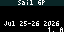

# SailGP Next Race and Standings

SailGP displays next race details and current standings details.

Displayed:

- Next Race
  - Series Title w/corresponding background
  - Next Race Name
  - Next Race Location
  - Dates of races (2 days of racing)
  - Scrolling list of standings w/Points

- Large Format Standings w/Flags
  - Scroll through standings showing country flag, position & current points

## Configuration
- Select Display Type (next race or standings)
- Select Standings Color
- Select Next Race Color (if next race display)
- Select date/time format (if next race display)

## Screenshot

## Data source

Standings, schedule and flags are produced by
[tidbyt-data-scripts](https://github.com/jvivona/tidbyt-data-scripts) and read
from the public [tidbyt-data](https://github.com/jvivona/tidbyt-data) repo
(`sailgp/standings.json`, `sailgp/nri.json`, `sailgp/flags.json`), so the device
never hits SailGP directly. The standings count is not hard-coded — the display
pages through however many teams are racing.
