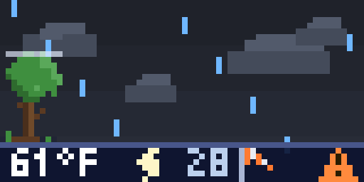
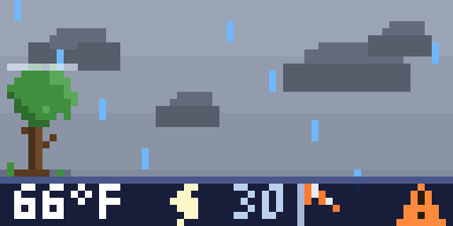
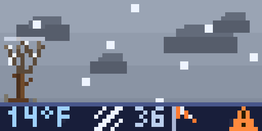
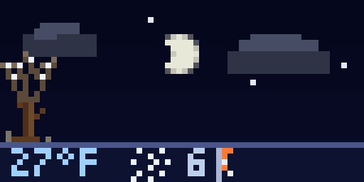
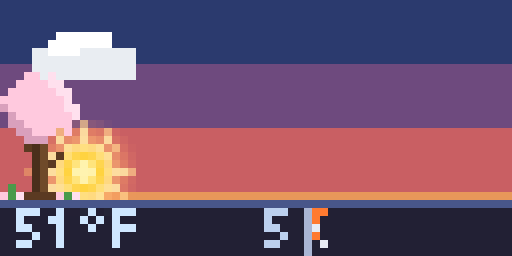
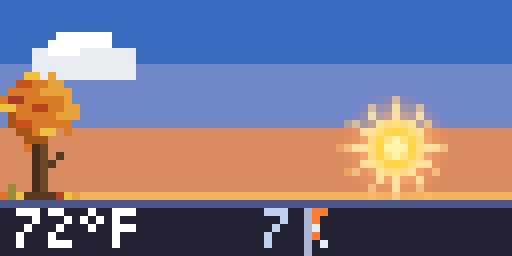
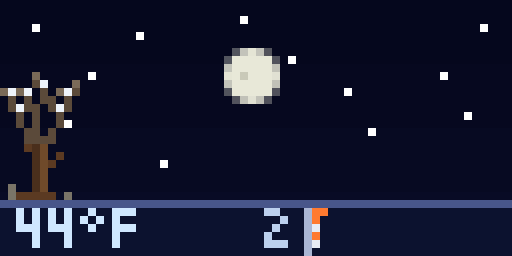

# Sky Today

A living pixel diorama of the **actual sky above you**.

Sky Today reads your real location's sun position, current weather, and moon phase, then paints an animated 64×32 scene that mirrors what's actually outside your window — a sky gradient that tracks the real sun, twinkling stars, a sun or correctly-phased moon arcing overhead, drifting clouds, falling rain or snow, wind effects, a tiny temperature + wind readout, and a severe-weather alert badge.

| Night thunderstorm | Hurricane | Thunderstorm |
|---|---|---|
|  |  |  |

| Blizzard | Gentle snow | Foggy morning |
|---|---|---|
|  |  |  |

| Sunrise | Golden hour | Starry night |
|---|---|---|
|  |  |  |

## What's on screen

- **A real-time sky.** The background gradient is chosen by the sun's true elevation at your location — high day, golden hour, sunset, twilight, deep night — and shifts through warm oranges and purples at dawn and dusk all on its own. Overcast skies flatten to a moody grey; fog turns the whole screen to a soft whiteout.
- **Sun and moon on a real arc.** A glowing sun travels a sine arc set by today's actual sunrise and sunset, casting a sunburst that grows from a low soft orb into full beaming rays as it climbs. After dark the moon takes over, drawn at its **current phase** — a thin waning crescent really is a thin sliver lit on the correct side.
- **Live weather.** 0–4 clouds scaled to real cloud cover, rain or snow at three intensities (drizzle → moderate → downpour), thunderstorm lightning, and fog — all driven by current conditions.
- **Wind that builds.** One intensity scale whose effects stack as it rises: calm clouds hold still, a breeze sets them drifting, a windy stretch adds gust streaks, a gale kicks up tumbling debris, and hurricane-force wind spins up a rotating eye — all blowing in the real wind direction, with a fluttering flag on the ground bar.
- **Severe-weather badge.** A small pulsing warning triangle lights up by urgency — yellow for an approaching thunderstorm, orange for an official *Severe* warning, red for *Extreme* (US National Weather Service).
- **Temperature.** A tiny readout on a translucent ground bar, tinted by value (cold blue → mild white → hot orange).

## Where the weather comes from

In the US, the scene is driven by the **nearest National Weather Service station's actual observation** — real temperature, present weather, and cloud layers — so the display matches what's really outside. Everywhere else it falls back automatically to **Open-Meteo**. Both are free and need no API key. Sun position and moon phase are computed locally, so the display stays alive and correct even with no network.

## Configuration

| Setting | Description |
|---|---|
| **Location** | The sky above this place — drives the sun arc, colors, weather, and timezone. |
| **Units** | Fahrenheit / mph or Celsius / km·h. |
| **Show temperature** | Toggle the temperature readout. |
| **Show wind** | Toggle the wind speed + fluttering flag. |
| **Weather source** | Auto (NWS in the US, else Open-Meteo), NWS-only, or Open-Meteo. |
| **Sun rays** | Subtle, Bold, or Off. |
| **Demo mode** | Override the real sky with one-click presets and manual dials to preview every look. |

**Demo mode** turns Sky Today into a mixing board for its own visuals — a Preset picker (Thunderstorm, **Night thunderstorm**, Blizzard, Gentle snow, Sunrise, Golden hour, Heatwave, Starry night, Crescent moon, Harvest moon, Hurricane, …) plus dials for sun elevation, moon phase, clouds, precipitation, fog, lightning, wind, alerts, and temperature.

---

By Evan VanDyke · built with [Pixlet](https://github.com/tidbyt/pixlet)
