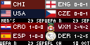
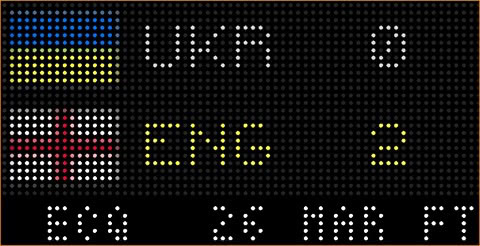
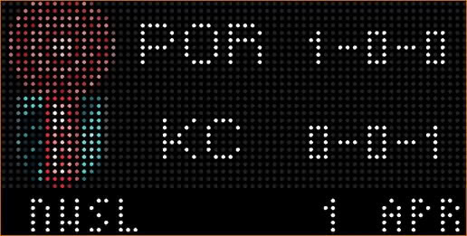
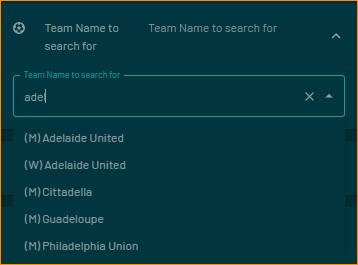
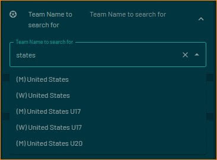

# Track single soccer team across all global tournaments / leagues they are playing in

Show upcoming / current / future game for a single soccer team across all leagues / tournaments they play in - one app tracks the team everywhere.  Handles all ESPN API leagues / tournaments.
Approx 3000 teams globally are in this app (2500 men's teams & 500 women's teams - including professional, international and college)

Displayed:

- Home / Away Teams & current record (if applicable for current league / tournament)
- Game's League / Tournament abbreviation
- If future game: Date & Time of upcoming game
- If inprogress game:  Score & Time
- If past game:  Final Score  (as per ESPN API - scores flip over to next game at 1AM US ET - future version coming to assist with this)

## Configuration
- Enter text to search team name (minimum 4 characters) - Women's teams are prefixed with a W & Men's with an M
- Which team to display first (home or away)
- Select display format type
- Select color for time (uses new schema.Color)
- 12 hour vs 24 hour time & US vs Intl date format

## Wide · Up to 4 Teams (2x displays)

On a 2x (128x64) display, pick the **Wide · Up to 4 Teams (2x)** display type and add up to 3 more teams
with the **Team 2 / Team 3 / Team 4** pickers (they're ignored by the other display types). Every team's
game shows at once - same design as the Soccer Mens / Soccer Womens Wide 4 view:

- 4 teams: 2x2 grid; 3 teams: two on top, one full width below; 2 teams: two full width; 1 team: one big card
- Each cell: competition + date strip, both teams (flag, code or name, score or W-D-L record), and a status strip -
  kickoff time, live clock (green), HT (amber), FT / FT with penalty tally (grey)
- Winners are shown in yellow; "Team color backgrounds" toggles the team-color bands
- If two of your teams play each other, the game is shown once
- On a 1x display this style shows a "needs a 2x display" notice; the original styles still work everywhere

## Thanks

Tons of thanks to @whyamihere/@rs7q5 for the API assistance - couldn't have gotten here without you
Thanks to @dinotash/@dinosaursrarr for making me think deep thoughts about connected schema fields & @matslina for setting me straight.
Of course - the original author of a bunch of this display code is @Lunchbox8484
Thanks to @jesushairdo for the option to be able to show home or away team first.  Let's be more international :-)

## Screenshot

## Schema Search for Teams

