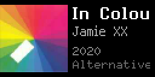

# Vinyl Roulette - Tidbyt App

Display a random vinyl from your Discogs collection on your Tidbyt device!

<!---->


## Features

- 🎵 Shows a random album from your Discogs collection
- 🖼️ Displays album artwork (thumbnail)
- 📝 Shows artist name and album title (with marquee scrolling for long names)
- 🔢 Optional stats line with year, track count, and total album duration
- 📂 Filters by Discogs folder IDs using `filter_by_folder` (comma-separated IDs; use `0` or leave blank for all folders)
- 🚫 Supports exclusion filters for folder IDs and artist IDs
- ⏱️ Caches data to minimize API calls (collection metadata 6h, release details 24h, folder names 24h)
- 🔄 Retries until it finds a vinyl entry

## 2x Resolution Support

This app supports both standard Tidbyt resolution (64x32) and 2x rendering (128x64).

- `manifest.yaml` includes `supports2x: true`
- Layout, fonts, spacing, animation timing, and image assets are adjusted using `canvas.is2x()`



Use Pixlet's `-2` flag to test 2x output locally:

```bash
pixlet render -2 vinylroulette.star
pixlet serve -2 vinylroulette.star
```

## What You'll Need

1. **A Tidbyt device** (obviously!)
2. **A Discogs account** with some records in your collection
3. **Your Discogs username**
4. **A Discogs Personal Access Token**

## Setup Instructions

### Step 1: Get Your Discogs Personal Access Token

1. Log into [Discogs](https://www.discogs.com)
2. Go to **Settings** → **Developers** (or visit [discogs.com/settings/developers](https://www.discogs.com/settings/developers))
3. Click **"Generate new token"**
4. Copy the token - you'll need it to configure the app

### Step 2: Configure the App Fields

- `username` (required): Your Discogs username
- `token` (required): Your Discogs personal access token
- `filter_by_folder` (optional): One or more folder IDs separated by commas (example: `12345,67890`). Use `0` or leave blank for all folders.
- `excluded_folders` (optional): One or more folder IDs to exclude
- `excluded_artists` (optional): One or more artist IDs to exclude

## How It Works

1. Parses your folder filter list from `filter_by_folder`
2. Fetches (or reuses cached) collection counts for each included folder
3. Picks a folder (weighted by item count), then picks a random record in that folder
4. Applies exclusions (folder IDs, artist IDs) and format checks (vinyl only)
5. Fetches full release details for track count and duration
6. Uses caching for collection metadata, folder names, and release details

## API Rate Limits

Discogs API allows:
- **60 requests/minute** for authenticated users
- Request count per refresh varies based on cache state, folder filters, and retries
- Typical usage remains well within Discogs limits for normal refresh intervals

## Troubleshooting

**"Set Discogs username" error:**
- Make sure `username` is filled in the app config

**"Set Discogs personal access token" error:**
- Make sure `token` is filled in the app config

**"API error: 401":**
- Your token may be invalid or expired
- Generate a new token at discogs.com/settings/developers

**"No releases in selected folders":**
- Verify the folder IDs in `filter_by_folder` exist in your Discogs collection
- Use `0` (or blank) to include all folders

**"Collection is empty":**
- Make sure your Discogs collection has records
- Check that your collection privacy is set to public (or you're using the correct token)

**"Could not find a Vinyl ..." errors:**
- Your filters may be too restrictive (`filter_by_folder`, `excluded_folders`, `excluded_artists`)
- Broaden or remove one or more filters

**No album art showing:**
- Some releases don't have images
- The app falls back to text-only layout

## Files

- `vinylroulette.star` - The main app code
- `README.md` - This file

## Credits

- Discogs API: https://www.discogs.com/developers/
- Tidbyt/Pixlet: https://tidbyt.dev

---

Enjoy your random vinyl discoveries! 🎶
