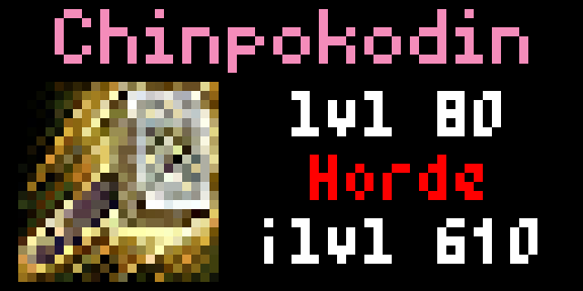

# WoW Character Stats
Show statistics for a World of Warcraft character. 

Stats shown include 
- Name 
- Class(icon)
- Character level
- Character faction
- Item level
- Mythic+ rating
- Raid progress

For testing via pixlet serve:   http://127.0.0.1:8080/?region=<region>&character=<character>&realm=<realm>&client=<client>&secret=<secret>

Client and Secret can be obtained by creating an account via https://community.developer.battle.net/ and creating a client

